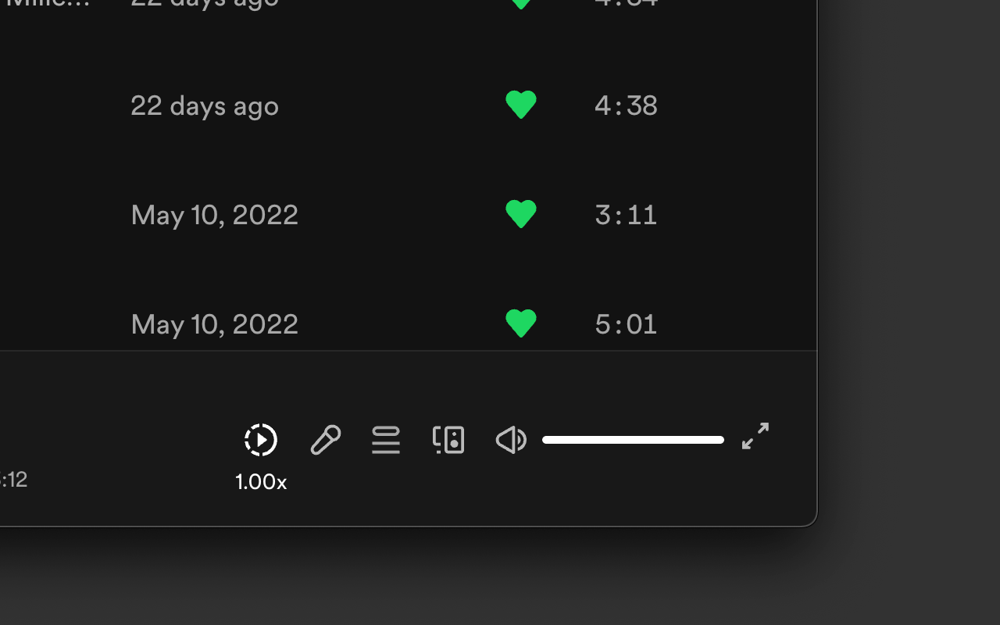
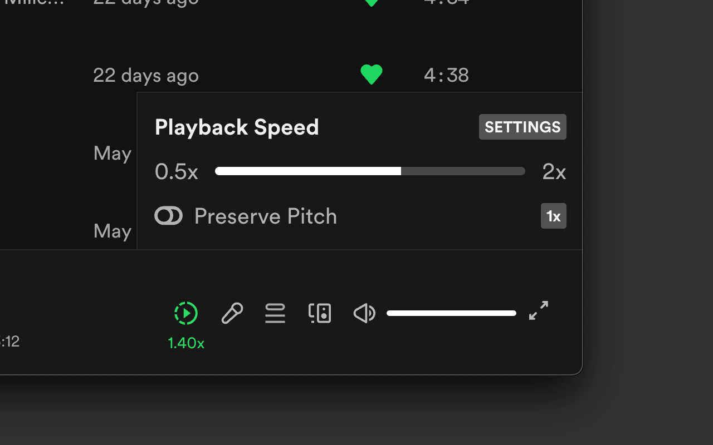

# Spotify Playback Speed

This extension provides an easy way to manipulate playback rate and pitch settings for Spotify Web.

### Requirements

-   Chrome / Any web browser that supports [bookmarklets](https://en.wikipedia.org/wiki/Bookmarklet)
-   Spotify Account

### Installation

You don't need the source code if you want to just use the extension

#### Chrome ver.

1. 	[Install from Chrome Web Store](https://chrome.google.com/webstore/detail/spotify-playback-speed/bgehnoihoklmofgehcefiaicdcdgppck)

2. 	Download latest release
	*  Download latest release from Releases
	*  Enable Developer Mode on Chrome's 'Manage Extensions' page
	*  Unarchive and drag folder onto 'Manage Extensions' page

#### Bookmarklet ver.

1. Create bookmarklet
2. Load Spotify and click bookmarklet while Spotify web player is loading
3. Retry and click bookmarklet earlier if not present or not working

### Screenshots

